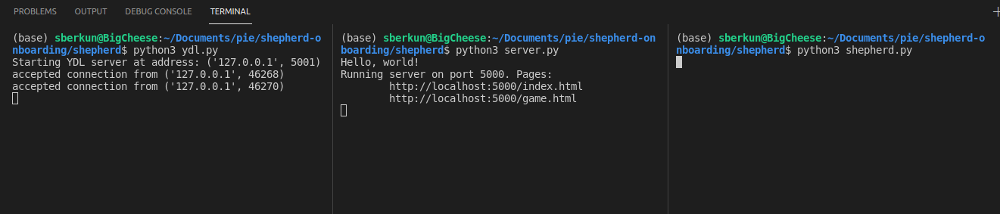
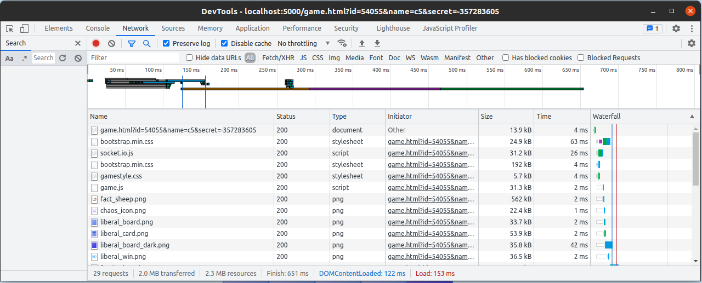
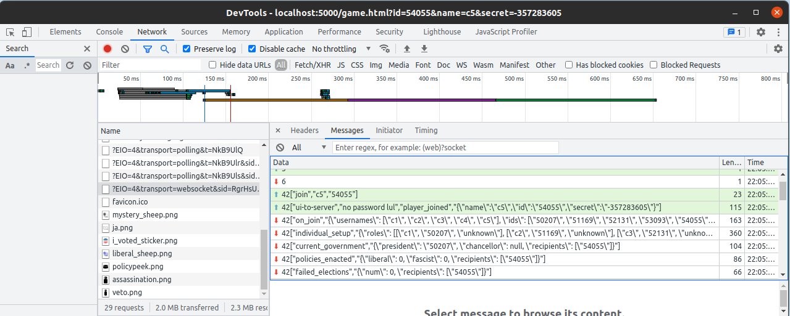

# Secret Hitler Instructions

Welcome to the Secret Hitler project! We suggest doing the mini-projects before starting the Secret Hitler project - if you haven't done this, head over to MINI-PROJ-1 and MINI-PROJ-2 to get acquainted with some of the tools that you'll be using in this project.

# Question 0A: Getting Started

First, let's get the game running. Open the `shepherd-onboarding/shepherd` folder in VSCode (or preferred editor) and then open 3 terminal windows in that folder (in VSCode, you can use the "Split terminal" button):
 - in the first window, run `python3 ydl.py`
 - in the second window, run `python3 server.py`
 - in the third window, run `python3 shepherd.py`

If all goes well, your teminals should have some output similar to this:



Open the `index.html` link shown in the second terminal. This should bring you to a login screen - make up any username and password (this won't be saved so it doesn't matter for now) and log in. You should be put into the lobby, where a very wise sheep will tell you fun facts.

Open `index.html` in 4 more tabs, and make up 4 more usernames/passwords. Now that you have 5 players, you should be able to click "start game"! However, when you do so, `shepherd.py` will crash. Your mission in this project is to fix the game, and successfully play a full game of Secret Hitler.

# Question 0B: Overview

There are a few main parts to this game:
 - `ydl.py` enables communication between Python files
 - `server.py` is a Flask server that serves the front-end content, much like the Flask server in the first mini-project.
 - `shepherd.py` handles all the game logic. However, it is only partially implemented, so you'll need to write much of it yourself.
 - `index.html` is the logic page.
 - `game.html` is the game page. This is mostly implemented, but you'll be completing it in Question 4.
 - `game.js` is the front-end logic for the game page. However, it is only partially implemented, so you'll need to write much of it yourself.

Most of your time in this project will be spent completing the game logic in `shepherd.py`, so there are a few main data structures you should be aware of:

 - players can be represented by their IDs (strings) or by player objects (which are stored in the `PLAYERS` global variable). Typically, we pass around the IDs, and index the `PLAYERS` dictionary to get the object (i.e. `player_obj = PLAYERS[player_id]`).
 - card decks (such as `CARD_DECK` and `DISCARD_DECK`) are typically lists of strings. The specific strings that represent each card can be found near the bottom of `Utils.py`.
 - powers, votes, and roles are represented by strings, which can be found near the bottom of `Utils.py`.
 - `BOARD` is a `Board` object, which can be made using the constructor in `board.py`.

The other global variables are explained in the comments of `shepherd.py`. We suggest reading through the section labelled `game variables` to get a good understanding of what each variable represents. If you have any questions, message us on Slack or ask us in worksession! 


# Question 1: Starting a Game

Go to `shepherd.py`, and search for a comment that says "BEGIN QUESTION 1". This is where you'll be implementing part of the logic for `start_game`, in order to set the game up correctly. You'll need to:
 - assign player roles (based on number of players)
 - initialize the board (based on number of players)

Once you have code that you think will work, test it using the instructions in section OA. This time, Shepherd should take slightly longer to crash, and you should see all players as sheep in a circle.

# Question 2: Sending a Header
Go to `shepherd.py` and search for a comment that says "BEGIN QUESTION 2". There are two of them. 
- The first one is inside `player_joined`, which is called when a new user logs in. Read the selected section, and feel free to poke inside the functions such as `send_current_government`, which is similar to the one you will be implementing.
- The second is in `send_policies_enacted`, which is called to send the UI information about how many liberal and fascist policies have been enacted. Per the comment description, look for `POLICIES_ENACTED` in `utils.py`.

Now, go to `game.js` and search for a comment that says "BEGIN QUESTION 2". This is the receiving end of the `policies_enacted` header - take a look around and try playing around with the code.

Once you have code that you think will work, test it using the instructions in section 0A. This time, Shepherd shouldn't crash at all! Now, open up "inspect element" on the webpage, and go to the network tab. If you __reload the page__ with the network tab open, you should see something like this:



This is essentially a list of all the network requests that happened when you loaded the page. Now, scroll down the list until you find a request that has "websocket" in the "Type" column (the name will likely begin with `?EIO=4&transport=websocket&...` or something similar). Click on the name of that request, then go to the "Messages" tab in the popup. It should look like this:



There should be a line that contains something like
```
["policies_enacted","{\"liberal\": 0, \"fascist\": 0, ...
```
If so, congrats! You've successfully completed a sender function. To summarize the lifecycle of a "shepherd to frontend" header:
 - First, a function in Shepherd calls the sender function. For example, we saw that `player_joined` calls `send_policies_enacted` in response to a page load.
 - The sender function (`send_policies_enacted`) calls `ydl_send` with a header from `Utils.py`. This passes the message to YDL (usng TCP sockets), and then YDL passes it to `server.py`.
 - `server.py` forwards the message to the correct recipient through a websocket.
 - On the browser side, a Javascript websocket recieved the message. This is what shows up in the network tab.
 - A Javascript function then parses the message (`JSON.parse`), and shows any changes on the game page. 

In general, if you have bugs, it's a good idea to check the network tab to see what exactly is being received by the frontend. This can help you isolate where the bug is happening.

# Question 3: The Democratic Process

> The best argument against democracy is a five-minute conversation with the average voter - Winston Churchill

So far, the game isn't very interesting. We can start a game without crashing `shepherd.py`, but that's about it. Let's implement an election cycle!

Here are the parts you'll have to read/implement:

 - `shepherd.py`:
    - look at to_pick_chancellor
    - fill out send_chancellor_request
    - fill out eligible_chancellor_nominees
 - `game.js`:
     - fill in messages in socket.on(chancellor_request)

Once you have code that you think will work, test it using the instructions in section 0A. This time, the president should be able to pick a candidate for chancellor, and everyone should be able to vote on whether they agree with the nomination or not. 

The voting logic has been pre-implemented for you, but we encourage you to try to figure out how it works. Try to answer the following questions:
   - How do the other players know who has been nominated for chancellor? What header gets sent and what function in `shepherd.py` sends it?
   - What header gets send from the front-end to shepherd when a player votes? What function receives and processes the vote?
   - Are there measures in place to prevent election fraud (i.e. someone voting twice, or someone voting for someone else)? If so, what are they?

# Question 4: Government Decisions

> Power tends to corrupt, and absolute power corrupts absolutely - Lord Acton

We can now elect a government, but what does the government do? Make bad decisions, of course!

Here are the parts you'll have to implement:

 - `shepherd.py`:
    - fill out president_discarded
    - fill out send_chancellor_discard
 - `game.js`:
    - fill out chancellor logic for on(chancellor_discard)
 - `game.html`:
    - 3rd card button

 Once you have code that you think will work, test it using the instructions in section 0A. This time, the president and chancellor should each be able to discard a card, enacting a policy and completing the election cycle. The cycle should then restart; the next president chooses a chancellor, everyone votes, etc.

# Question 5: Game Over

> People who live in glass houses should shut the fuck up - Ready Player One

We now have a smoothly-running society that can choose its government, enact policies, and argue with each other over who's secretly a fascist. But an eternal society isn't very fun - all things must come to an end, including the game. There are 4 ways that this can happen: 
 - If Hitler is elected after 3 fascist policies, he builds a fascist utopia, and the fascists win
 - If Hitler is executed, the fascists are leaderless, the movement dissolves into chaos, and the liberals win.
 - If 5 liberal policies are enacted, the liberals build a liberal distopia, and they win.
 - If 6 fascist policies are enacted, the fascists build a fascist utopia, and they win. 


Here are the parts you'll have to implement:

 - `shepherd.py`:
    - hitler is elected game over logic
    - policies enacted game over logic
    - hitler is executed game over logic
    - fill out game_over

Once you have code that you think will work, continue to question 6. You won't be able to test any of the win conditions (besides liberals winning on policies) until after you implement actions.

# Question 6: Special Actions

> Every triangle is a love triangle when you love triangles - Pythagoras

This is the final stretch of the game! Here you'll be implementing actions / executive powers, which the president can use after the 3rd fascist policy. Specifically, the powers are:
 - investigate loyalty - the president chooses someone to investigate, and gets shown whether they are liberal or fascist.
 - special election - the president chooses the next president
 - policy peek - the president is shown the top 3 cards of the deck
 - execution - the president chooses someone to have an "accident"
 - veto - if the president and chancellor both don't like the cards, they can veto instead of enacting a policy. However, the president and chancellor must agree.


Here are the parts you'll have to implement:

 - `shepherd.py`:
    - look at investigate_player
    - fill out call_special_election
    - fill out send_loyalty
    - fill out call_special_election
    - fill out policy_peek
 - `game.js`:
    - fill in investigate_player(id)

Once you finish implementing these parts, make sure to test both question 5 and question 6, as well as a few other things. Specifically, we recommend testing:
 - After a policy is enacted, there shown be a UI change that shows how many liberal and fascist policies have been enacted
 - All 4 win conditions should work, and end the game
 - Make sure that electing Hitler before the 3rd fascist policy does not end the game.
 - Test games with 5 players, 6 players, and 7 players. 7-player games should have different actions from the 5/6 player games.
 - The veto power should only be enabled after the 2nd-to-last fascist policy is enacted.
 - If the president denies a veto, the chancellor should not be able to re-request a veto. On the next round, the chancellor should be able to request a veto again.

 Once everything works, congratulations! You've successfully implemented the game Secret Hitler. Take a moment to relax and pat yourself on the back.

# Question 7: Improvements (Optional)

> Art is never finished, only abandoned. - Leonardo da Vinci

Not satisfied with your shiny new game? Help us improve it! At this point you have two options:
 - You can continue working on the `master` branch, and let us know of any improvements that you make. We can then add them to next year's project.
 - You can switch the the `solution` branch, which contains our version of the fully implemented game. Once you make your improvements there, you can make a pull request to the main onboarding repo, which will help us add your improvements much more quickly.

Here are some suggestions on things you could work on:
 - Near the bottom of `game.js`, there's a list of fun facts that get shown to the players. Add your own fun facts to this list!
 - You can add more interesting dialogue for certain actions.
 - You can add your own artwork to the game; replace image files in `shepherd/static/assets`, or add additional image files there and edit `game.html` and `game.js` appropriately.
 - If parts of this spec were confusing or unclear, feel free to edit this spec to improve it.
 - If you feel like different parts of the code should be emphasized for the questions, you can move/add question blanks. Make sure to edit this spec as well, to match the new questions.
 - On github at https://github.com/pioneers/shepherd-onboarding, there's a tab called "Projects", which should have a single project for the current year. This is where we keep track of known issues / stuff we want to work on; feel free to ask us about anything on the project board.

You're not restricted to this list - feel free to work on anything you feel can be improved. Finally, this part is completely optional; feel free to work on schoolwork or other projects instead.


